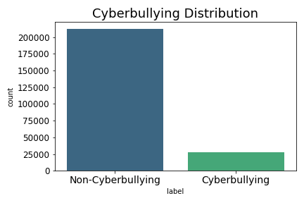
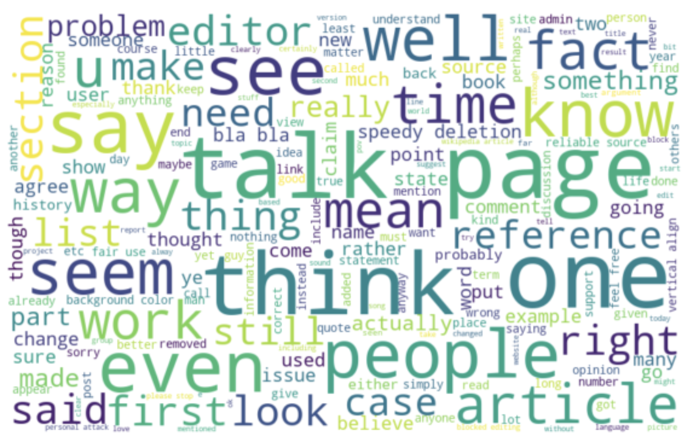
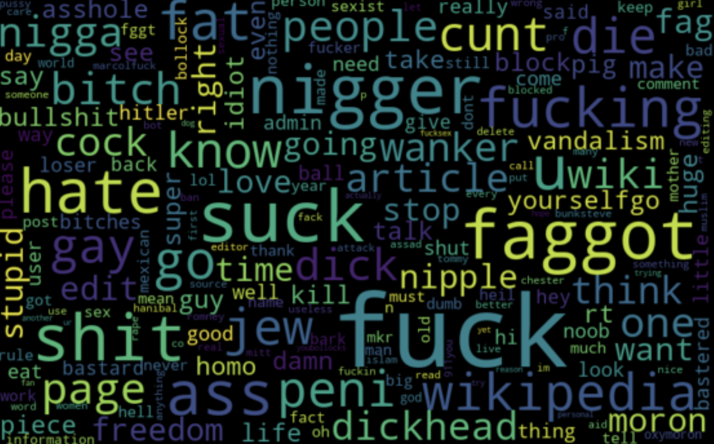
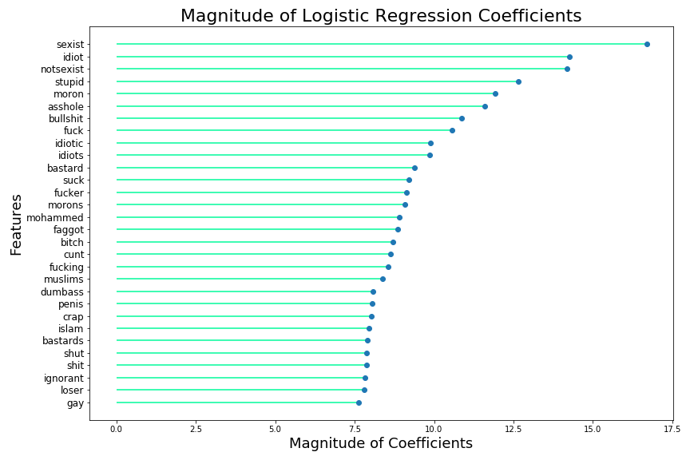
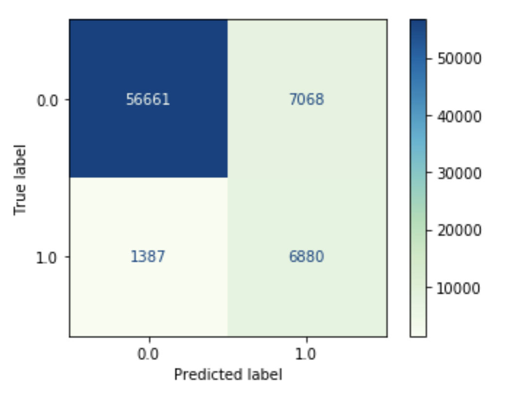
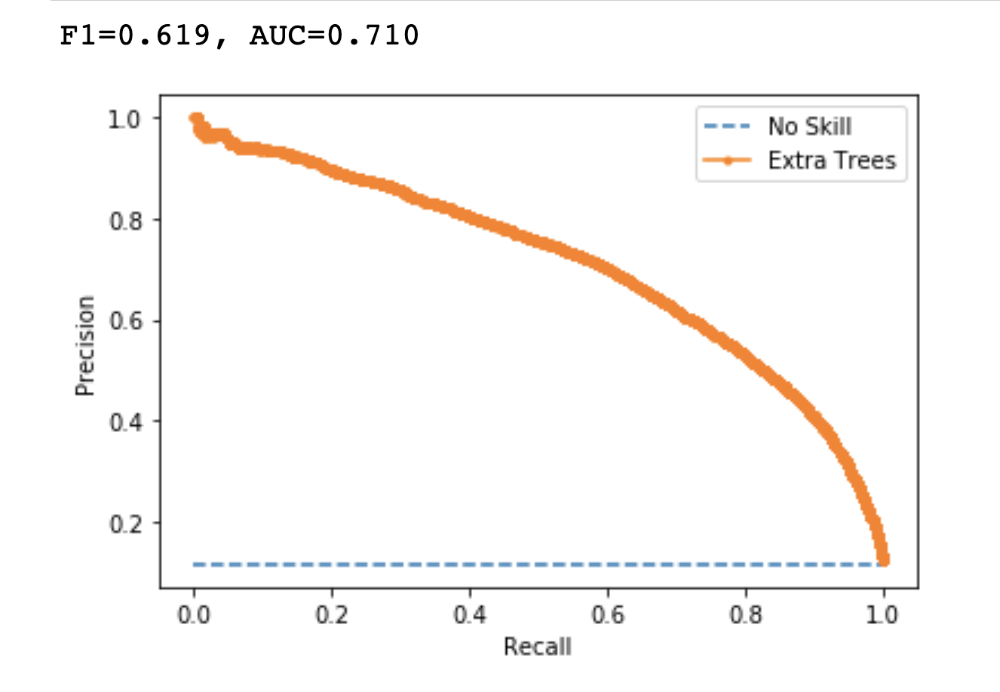

# Cyberbullying Classification
Capstone Project for Data Science Program at Flatiron School

**Author**: Diane Tunnicliffe

## Overview

As the social media world becomes more and more significant in all of our lives, many questions remain about the impacts of social media use on children. A major, current concern of many pediatric organizations and children's advocacy groups is the prevalence of cyberbullying on social media, and the negative effects that are observed as a result. Studies have shown that "Adolescents who are targeted via cyberbullying report increased depressive affect, anxiety, loneliness, suicidal behavior, and somatic symptoms. Perpetrators of cyberbullying are more likely to report increased substance use, aggression, and delinquent behaviors." [[1]](https://www.dovepress.com/current-perspectives-the-impact-of-cyberbullying-on-adolescent-health-peer-reviewed-fulltext-article-AHMT) That being said, it is of utmost importance to be able to predict cyberbullying as it happens, so that we can identify and remove these types of posts before they detrimentally affect our children.  

In this project, I will explain how cyberbullying can be classified and predicted, and provide exploratory data analysis to illustrate the wide range of topics that are included in this scope. I will then show how cyberbullying posts can be predicted by classification models and how these models can be interpreted and evaluated, and introduce an interface that can make predictions in realtime, so that posts like these can be detected before being seen by the public eye. 

## Business Problem
As a parent myself, with both an interest and academic background in psychology, I find myself feeling a strong need to protect children from online threats. But beyond my personal feelings about this problem, it has been shown to be a widespread issue that demands swift addressing.  

"Adolescents in the United States culture are moving from using the Internet as an “extra” in everyday communication (cyber utilization) to using it as a “primary and necessary” mode of communication (cyber immersion) In fact, 95% of adolescents are connected to the Internet. This shift from face-to-face communication to online communication has created a unique and potentially harmful dynamic for social relationships – a dynamic that has recently been explored in the literature as cyberbullying and Internet harassment." [[1]](https://www.dovepress.com/current-perspectives-the-impact-of-cyberbullying-on-adolescent-health-peer-reviewed-fulltext-article-AHMT) 

"Cyberbullying, while following many of the underlying dynamics of more traditional forms of bullying, features some unique qualities that can both magnify the damage caused and make it more difficult to detect. These features include the pervasive, never-ending nature of cyberbullying and the ability to quickly reach large audiences. The potential for anonymity and the related distance afforded by screens and devices compared to in-person interaction allow the cruelty of cyberbullying to go unchecked. Despite the perceived anonymity of cyberbullying, cyberbullying can be perpetrated by friends, who often have intimate knowledge about the victimised youth that can be devastating when made public." [[2]](https://journals.sagepub.com/doi/10.1177/0706743716684791)  

Since this is such a prevalent problem that we are dealing with as a society, we need to address the following questions:
1. Can we automate cyberbullying classification, and if so, what type of model is best for this application?
2. Using Natural Language Processing, what features are given highest consideration by a machine learning classification algorithm? Are there certain words that are strongest predictors of cyberbullying? What can we do to find these?
3. Which evaluation metric is best suited to this task? How can we prioritize the prediction of cyberbullying content to predict and prevent as much as possible?  

If we can answer these questions, then we can begin to protect children from the threat of cyberbullying and the very real impacts that it can cause.

## Method

The work in this repository follows the CRISP-DM method. I imported data from reputable sources, combined it into a major dataframe, then cleaned, processed, tokenized, and vectorized the data. I also utilized NLTK's TweetTokenizer within my data processing function. I then adjusted the data to account for class imbalance. I utilized descriptive statistics as well as visualizations to illuminate trends in the data and isolate key factors for making cyberbullying predictions. I built pipelines and grid search functions to iterate through a high-performing logistic regression model and find optimal hyperparameters. When I determined my best model, based on the recall metric for this particular case, I evaluated it thoroughly so that I could make informed recommendations.

The data for this binary classification problem has two possible outcomes: 1 (Cyberbullying) or 0 (Non-Cyberbullying).



I utilized the class_weight='balanced' sklearn parameter to account for the class imbalance and provide a more accurate model.

## Results
There are certain words that appear most often in the non-cyberbullying class:



And there are certain words that appear most often in the cyberbullying class:



It is clear to see that there are certain words that are offensive regardless of their context. For this reason, I opted for a Bag of Words method of analysis, where the words themselves act as features and context is not necessary. The model performed well with this method. After applying Term Frequency-Inverse Document Frequency (TF-IDF) Vectorization to the content, the coefficients of the logistic regression model showed the following words as having the highest magnitude:




## Evaluation
All models were primarily evaluated on the recall/sensitivity metric to determine which model performed best. I iterated through three models in total: baseline (Decision Tree), Logistic Regression, and finally Logistic Regression with grid search for hyperparameter optimization. This final one performed the best.

The positive class is 'Cyberbullying' and the negative class is 'Non-Cyberbullying'. I want to ensure that we catch every possible instance of harmful posts before they are publicly seen and can cause damage. Therefore, I have prioritized Recall/Sensitivity as the metric by which to evaluate the models. This will ensure that we can capture as many instances of the positive class as we can, which makes this the most important metric for the problem at hand. By doing this, we avoid false negatives or Type II errors.  


That being said, my best model was the one using the Logistic Regression Classifier with gridsearch for hyperparameter optimization. This model achieved a recall score of 83%, meaning that 83% of the cyberbullying class in the test set was captured by the model. It has an accuracy score of 88%, meaning that 88% of the total predictions made by the model were correct. It is important to note that while there is a trade-off between recall and precision, which affects accuracy, it is tough to put a price on the safety and wellbeing of children. So I have chosen to prioritize recall at the expense of other metrics for this particular problem.  

This model will be well-suited to real world application because it is fast, efficient, and good at making live predictions! Please see the "API_and_predict" notebook for a demonstration of applying this model to tweets obtained via Twython and the Twitter API. 





The precision-recall curve above shows the tradeoff between recall and precision. This is also demonstrated by the model's F1 score of 62%. The AUC or Area Under the Curve of 71% also confirms that this model is working relatively well. Based on the performance of the model, especially the recall/sensitivity rate of 88%, I am confident that the model can catch many instances of cyberbullying content.

## Conclusion
In conclusion, NLP and text classification provide easily accessible and interpretable insight into cyberbullying detection. ML models are able to predict if a post should be classified as cyberbullying, using the occurrence of offensive words, with a high level of recall/sensitivity. Between the high predictive power of these models and the expert knowledge of child psychologists and educators, youth and adolescent health could and should be prioritized. By doing this, the problem of online safety for children can be addressed.

### Recommendations
1. I recommend the use of a fast and efficient classification model, like the one above, to be implemented to predict cyberbullying in real-time and prevent this content from being posted in the first place. The metrics shown support this recommendation, and the demonstrations in the following notebook will show how well this can work on untrained data.
2. Certain words have shown to be strong, frequent predictors of cyberbullying, with no context necessary. They manifest as high-frequency words in the cyberbullying class, and as model coefficients of larger magnitude. I recommend that these certain offensive words, as illustrated by the various EDA visualizations in this project, be blocked on sight. If a post contains one of these highly offensive words, the content should be flagged.
3. I recommend keeping the focus on recall, as illustrated by the model and confusion matrices above, to focus on prevention above accuracy. Since the goal is to protect children from the harm that cyberbullying can cause, the most effective way to do so is to reduce Type II errors or false negatives.

## Future Work
I am curious about n-grams (bigrams, trigrams) and their importance for this type of data. I focused mainly on the "trigger words" that should immediately be flagged as cyberbullying, but the context and combinations of words could play an important role as well. While the logistic regression model performs very well, I'd also like to explore the application of a neural network for cyberbullying classification. Finallly, the acquisition of even more data would likely improve the metrics here as well.  

Please see the notebook "API_and_predict", for a demonstration of this model being used on data obtained from Twitter's API. 

## For More Information

Please review my full analysis in [my Jupyter Notebook](./preprocess_model_evaluate.ipynb) or my [presentation](./cyberbullying_detection.pdf).

For any additional questions, please contact **Diane Tunnicliffe** at diane.j.tunnicliffe@gmail.com.

## Repository Structure


```
├── README.md                           <- The top-level README for reviewers of this project
├── intro_problem_EDA.ipynb             <- First notebook. Data understanding & EDA.
├── preprocess_model_evaluate.ipynb     <- Second notebook. Preprocessing & models.
├── API_and_predict.ipynb               <- Third notebook. API calls & new predictions.
├── cyberbullying_detection.pdf         <- PDF version of project presentation
└── images                              <- Visualizations generated for analysis
```
